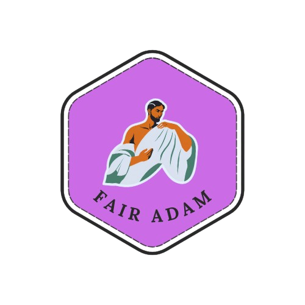

<!-- README.md is generated from README.Rmd. Please edit that file -->

# Fair Adam Quarto Templates <a href="https://github.com/jpmonteagudo28/fair_adam"></a>

<!-- badges: start -->
<!-- badges: end -->

## Why is your repo titled Fair Adam?

I wanted to come up with a fancy, clever name but my inspiration failed
me. I then turned to `despair`😁, a package that generates
de/motivational quotes and bard-bits - Shakespeare inspired codes for
personal projects.

``` r
library(despair)
despair.message()

bard.bits("character",seed = 99)
```

## Installation

``` bash
quarto add jpmonteagudo28/fair_adam
```

## Templates
